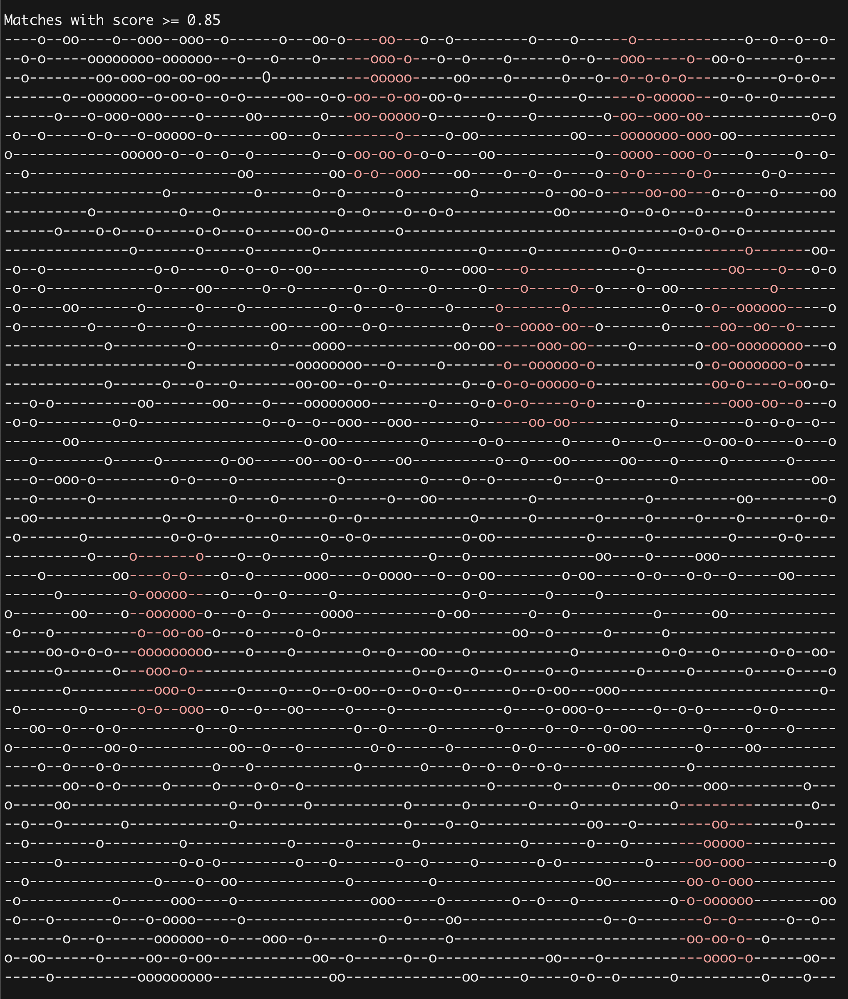
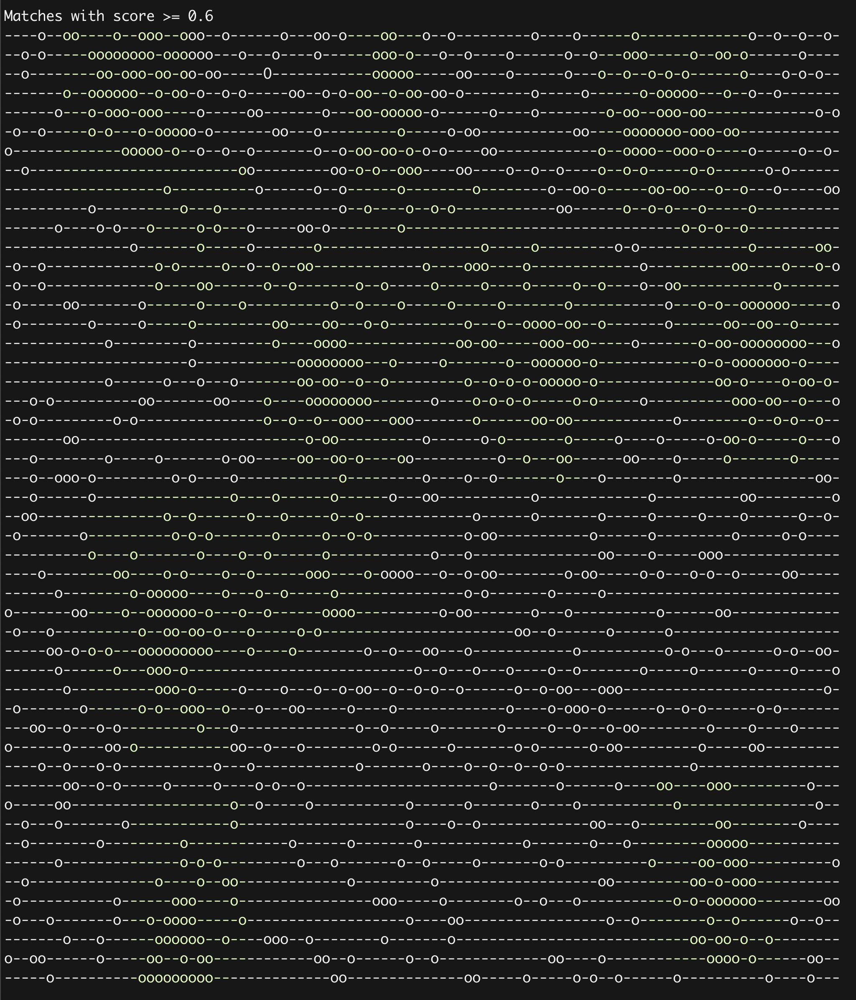
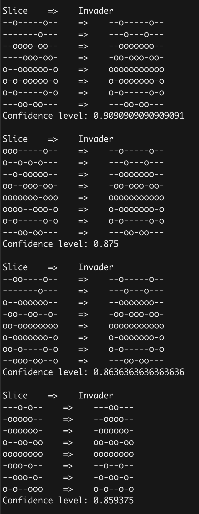

# Invaders

To run the program:

```
$> bin/find_invaders
```

To run the specs:

``` 
$> rspec spec
```

## Assumptions

I had to make some assumptions about requirements/effort, here's my list:

* Ignore rotation for invaders and the radar reading, everything is matched as given
* Invaders ar hardcoded as `Invaders::KNOWN_INVADERS`
* Radar reading can be changed in toplevel `radar_data` file

## Matching heuristic

Matching exact shapes will probably return bad results because of the possible noise.
For that reason I implemented `MatchStrategies` The one used by the program computes
the ratio of exact matches to all tiles for each invader.

For example:

```
Slice    matches    Invader

ooo-----o--    =>    --o-----o--
o--o-o-o---    =>    ---o---o---
--o-ooooo--    =>    --ooooooo--
oo--ooo-oo-    =>    -oo-ooo-oo-
ooooooo-ooo    =>    ooooooooooo
oooo--ooo-o    =>    o-ooooooo-o
o-o-----o-o    =>    o-o-----o-o
---oo-oo---    =>    ---oo-oo---

Confidence level: 0.875
```

`MatchStrategy` is expected to return match level (0-1) in the runner (`Invaders::Find`) I hardcoded
two confidence levels to show that with the lowel level we can find multiple suspectable regions.

## Example output

* High probability of a match (high threshold)


* Low probability of a match


* List of match => invader pairs

